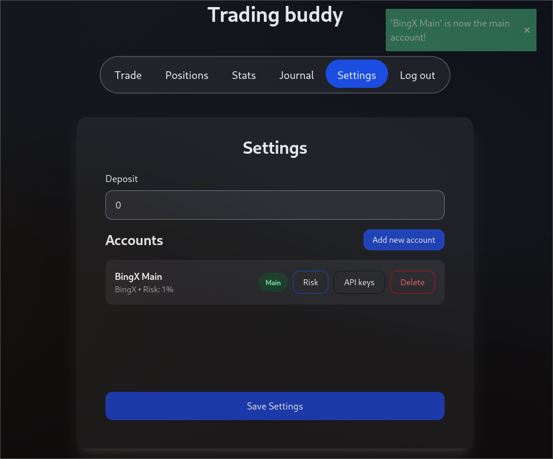
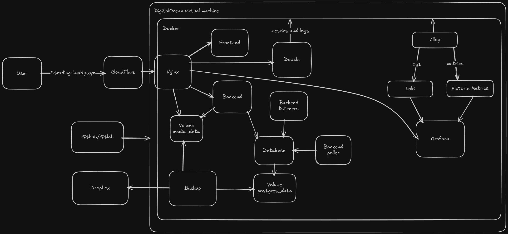
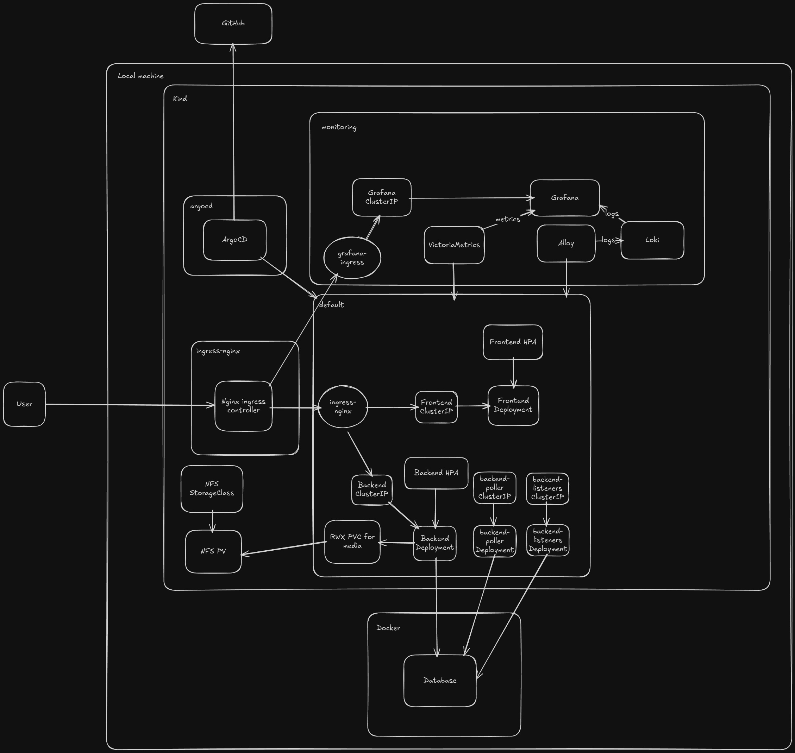

# Intro
Trading buddy is a web client for trading with reliable, convenient and automatic position management and tracking 

For more details check out [article on my blog](https://avtorgenii.github.io/blog/blog/2025-11-07-trading-buddy-2.0/)

# Screenshots
Copied from the [article](https://avtorgenii.github.io/blog/blog/2025-11-07-trading-buddy-2.0/) actually





# Docker Compose



## Monitoring
Trading-Buddy features two monitoring stacks - appropriate one and overkill one:

- Appropriate one is Dozzle as a single container, you can see it under MONITORING > LIGHT section - it gathers and stores logs for all containers and shows real-time metrics for CPU and RAM usage and even features authentication. Eats at most 80Mi of RAM

- Overkill one is composed of:
    - Grafana Alloy for gathering metrics and logs
    - Victoria Metrics for storing metrics
    - Grafana Loki for storing logs
    - Grafana for displaying logs and metrics
This stack eats more RAM than whole my app so there's not much point in utilizing it on VPS

## CI/CD
For CI/CD both GitLab CI/CD and GitHub Actions could be used - both .yml files for each method are present in repo. GitLab is preffered option as sometimes deployment stage fails with GH actions due to some connections problem to remote virtual machine. Compose app is being launched on VM via exporting DOCKER_HOST and executing docker commands from runner on remote VM without need of copying sensitive data to the machine.


# Kubernetes
In ```infra/kind-k8s``` you can find set of k8s resources which deploy Trading-Buddy into any k8s cluster



## Monitoring
Monitoring stack is composed from components below, all of them need to be installed as helm charts:
- ```vm/victoria-metrics-k8s-stack``` - metrics gathering and storing
- ```grafana/loki``` - storage for logs
- ```grafana/k8s-monitoring``` - gathering of logs via Alloy and displaying metrics and logs via Grafana


## GitOps
ArgoCD is used for monitoring changes in .yaml files in infra/kind-k8s


# Running locally
Create all your ```.env``` files in the root of the project dir
<details>
<summary><code>.env.dev</code></summary>

Below is how your `.env.dev` must look like:
```
##### Frontend #####
VITE_API_BASE_URL=http://backend:8000/api/v1
VITE_API_SUFFIX=/api/v1
VITE_API_BE_BASE_URL=/api/v1
##### Backend #####
SECRET_KEY=<>
# True means launching backend from IDE, and database in docker, False - both backend and database in docker
DEBUG=True
ALLOWED_HOSTS=localhost,127.0.0.1,backend,nginx
CORS_CSRF_ALLOWED_ORIGINS=http://localhost,http://localhost:5173
SESSION_COOKIE_SECURE=False
CSRF_COOKIE_SECURE=False
CSRF_COOKIE_HTTPONLY=False
CSRF_USE_SESSIONS=False
CSRF_COOKIE_SAMESITE='Lax'
CORS_ALLOW_CREDENTIALS=True
##### Database #####
DB_NAME=postgres
# Name of db service in docker-compose.yml or name of the host (localhost when running on local machine and database has exposed port)
DB_HOST=localhost
DB_USER=<>
DB_PASSWORD=<>
##### SSO #####
GOOGLE_OAUTH_CLIENT_ID=<>
GOOGLE_OAUTH_SECRET=<>
LOGIN_REDIRECT_URL=/trading
```

SSO ones are optional - app will run fine without them as well

</details>

<details>
<summary><code>.env.prod</code></summary>

Production version is the same as dev one except for values below:
```
DEBUG=False
DB_HOST=db
ALLOWED_HOSTS=localhost,127.0.0.1,backend,nginx,<domain>
CORS_CSRF_ALLOWED_ORIGINS=http://localhost,http://localhost:5173,http://<domain>,https://domain
```

</details>

<details>
<summary><code>backup.env</code></summary>

Below is how your `backup.env` for dropbox backups must look like:
```
DROPBOX_REMOTE_PATH=<>
DROPBOX_APP_KEY=<>
DROPBOX_APP_SECRET=<>
DROPBOX_REFRESH_TOKEN=<>
```

If you want to run app ASAP you can skip backups setup, app will work fine without them as well.

Here is the guide I used to obtain all above variable values and setup dropbox for backing up in total: [guide](https://www.youtube.com/watch?v=GhG2aDsx9sE)

</details>

## Locally
### Docker compose
If you just want to try out the project locally you can clone the repo and launch it in docker, for this you will need configured ```.env.dev```

After creating and setting up ```.env.dev``` simpy run command below to launch app via docker from the root dir of the repo:
```
make compose-dev
```

or If you don't have ```make``` installed

```
docker compose -f docker-compose.dev.yml --env-file .env.dev up --build -d
```

### IDE
For running from IDE you need to complete steps below:
1. Clone repo
    ```
    git clone https://github.com/avtorgenii/trading-buddy-2.0.git
    ```
2. Initialize ```venv``` for the backend:
    ```
    cd trading-buddy-2.0/trading_buddy_backend
    uv sync
    ```
    If you don't have ```uv``` yet here is the [installation guide](https://docs.astral.sh/uv/getting-started/installation/)

3. Setup ```.env.dev``` as shown in section above


4. Initialize SvelteKit frontend as in ```README.md``` instruction in ```trading_buddy_fe``` dir:
    ```
    cd trading-buddy-2.0/trading_buddy_fe
    npm install
    ```
5. During development, I ran database only in docker container so just run command below from root of the project to create container for database:
    ```
    docker compose -f docker-compose.dev.yml --env-file .env.dev up -d db
    ```
Launch backend and frontend via CLI and app will be available at ```http://localhost:5173/```:
```
# In backend dir - execute in separate shells
python manage.py runserver
python manage.py run_poller
python manage.py run_listeners


# In frontend dir
npm run dev
```

Every time you add changes to database scheme in ```models.py``` you have to run commands below for changes to be applied:
```
python manage.py makemigrations
python manage.py migrate
```
Dockerfile for backend applies migrations for you on the build stage


# Usage
For more usage details check out [article on my blog](https://avtorgenii.github.io/blog/blog/2025-11-07-trading-buddy-2.0/)
## Rules of usage
1. Currently restricted to open multiple trades on the same tool within one trading account, on app side you will be unable to do that, 
   but if you open it on exchange side, handling orders and positions system will **FAIL**.
2. All decimals have maximum 20 digits, of which 12 are reserved for places after coma, which means that when BTC or any
   other trading tool will approach price of 100mln, code should be updated.
3. For now, manual cancellation of any order on the exchange side, breaks logic flow.
4. Exchange restricts placing Stop-loss order above current price, so unless your take-profits are meticulously near your entry price, or are take-losses actually, you should be fine,
   otherwise you may need to place stop-loss orders manually on exchange side 
5. If you have opened position on exchange side, but it is not in database, it won't show up in your current and pending positions

## General info
1. All datetimes are in UTC without any timezone info
2. Default mode of all trades is **Cross Margin**